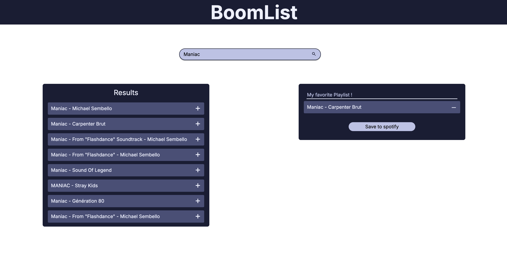

# Jamming-App



## Introduction 

This project is part of my web development learning path from Codecademy.
The goal was to work my Frontend skills, creating a web app from scratch.

The app allows a user to create and save playlist to their spotify account.

## Technologies used

I made a simple design of the app using Figma.

I chose [Vite](https://vite.dev/) for this project because it offers an incredibly fast development experience, with instant hot module replacement and optimized builds. For the frontend, I went with [React](https://react.dev/) as it’s my go-to library for building dynamic user interfaces, and I wanted to further sharpen my skills with it.

[Spotify API](https://developer.spotify.com/documentation/web-api/reference) is of course used to search for tracks, and save playlist to the user account.

I also had to use ngrok for tunneling, because spotify API doesnt allow `localhost` as redirect URI (see spotify [documentation](https://developer.spotify.com/documentation/web-api/concepts/redirect_uri)).

## Features

The app has the following features : 
- Connect the app to the user's spotify account, using [Authorization Code with PKCE](https://developer.spotify.com/documentation/web-api/tutorials/code-pkce-flow).
- Automatic spotify access token refresh.
- Search track using a simple string.
- Modify and create a playlist, exporting it to the user's spotify account.

## Future work

- Make the app responsive.
- Restyle authentification page.
- Deploy the app online.
- Add automated tests in CI.
- Add technical documentation.

## Installation and Setup

To run the app locally, follow these steps:

1. Clone the repository:
    ```bash
    git clone https://github.com/Haotin00/jamming-app.git
    ```

2. Navigate to the project directory:
    ```bash
    cd jamming-app
    ```

3. Install dependencies:
    ```bash
    npm install
    ```

4. Configure your Spotify API credentials:
    - Create a Spotify Developer account and register your app.
    - Set up the base URL using ngrok or another tunneling tool.
    - Setup the the following variables in a `.env` file with your Spotify client ID and redirect URI.
    
    `.env`
    ```dotenv
    VITE_SPOTIFY_CLIENT_ID=
    VITE_BASE_URL=
    ```

5. Start the development server:
    ```bash
    npm run dev
    ```

6. Open the app in your browser

## License

This project is licensed under the MIT License. See the [LICENSE](LICENSE) file for details.
